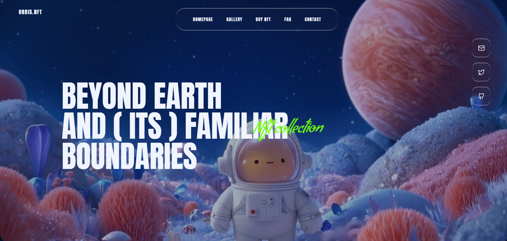

<div align="center">

# ✦ VIBE CODED

**A dark, space-themed NFT landing page template**

_Cinematic visuals · Liquid-glass UI · Immersive aesthetics_

<br/>

[](https://react.dev)
[](https://www.typescriptlang.org)
[](https://vitejs.dev)
[](https://tailwindcss.com)

[](./LICENSE)
[](https://github.com/yourusername/vibe-coded/pulls)
[](https://github.com/yourusername)

</div>

---

## 📸 Preview

<div align="center">
  
</div>

---

## 🌌 About

**Vibe Coded** is a concise, shareable NFT landing page template built with a dark, space-themed aesthetic. Designed for NFT drops, artist showcases, and promotional microsites — it's production-ready, visually striking, and fully customizable.

> **Open use** — fork it, ship it, build on it. Credit appreciated, never required.

---

## ✨ Features

- 🎬 **Cinematic Backgrounds** — Video backgrounds with texture overlays for deep, immersive visuals
- 🪟 **Liquid-Glass UI** — Frosted glass cards with neon accents and custom branded typography
- ♿ **Accessible Accordion** — Radix-powered FAQ section with keyboard navigation and ARIA support
- 📱 **Fully Responsive** — Optimized layout for both desktop and mobile viewports
- ⚡ **Blazing Fast** — Vite-powered dev/build pipeline with near-instant HMR

---

## 🛠 Tech Stack

| Technology                                                                                 | Purpose                  |
| ------------------------------------------------------------------------------------------ | ------------------------ |
| [Vite](https://vitejs.dev)                                                                 | Build tool & dev server  |
| [React](https://react.dev)                                                                 | UI framework             |
| [TypeScript](https://www.typescriptlang.org)                                               | Type safety              |
| [Tailwind CSS](https://tailwindcss.com)                                                    | Utility-first styling    |
| [@radix-ui/react-accordion](https://www.radix-ui.com/primitives/docs/components/accordion) | Accessible FAQ component |

---

## 🚀 Getting Started

### Prerequisites

- Node.js `v18+`
- npm or your preferred package manager

### Installation

```bash
# 1. Clone the repository
git clone https://github.com/yourusername/vibe-coded.git
cd vibe-coded

# 2. Install dependencies
npm install

# 3. Start the development server
npm run dev
```

Open [http://localhost:5173](http://localhost:5173) in your browser.

### Production Build

```bash
npm run build
```

Preview the production build locally:

```bash
npm run preview
```

---

## 📁 Project Structure

```
vibe-coded/
├── public/
│   └── image.png          # Screenshot / static assets
├── src/
│   ├── components/        # Reusable UI components
│   └── main.tsx           # Application entry point
├── index.html
├── tailwind.config.ts
├── vite.config.ts
└── tsconfig.json
```

---

## 🤝 Contributing

Contributions are welcome! If you have ideas for improvements or spot a bug:

1. Fork the repository
2. Create a feature branch — `git checkout -b feat/your-feature`
3. Commit your changes — `git commit -m "feat: add your feature"`
4. Push to the branch — `git push origin feat/your-feature`
5. Open a Pull Request

Please follow conventional commit messages and keep PRs focused.

---

## 📄 License

This project is **open use** — feel free to use it in personal or commercial projects without restriction. Attribution is appreciated but entirely optional.

---

<div align="center">

## 👤 Author **Nirmal Kharal**

_Built with ☕ and good vibes._

⭐ **Star this repo if you found it useful!**

</div>
